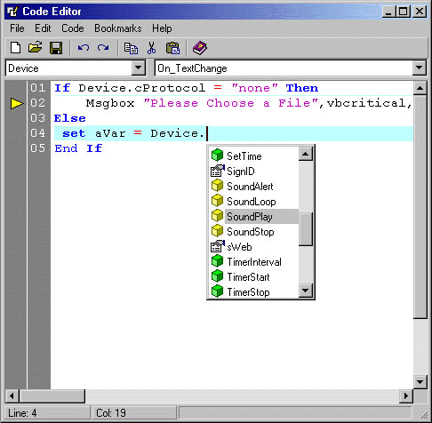



## Kick Butt Intellisense

### Description

This script editor is in the beginning stages, but is already very advanced.

If you are coding in one of the following languages, this this will save you a ton

of time.

VB Script

Java Script

Delphi Script

D+ (on Planet Source Code)

DM+ (on Planet Source Code)

Jel (on Planet Source Code)

WinScript (on Planet Source Code)

Personally I plan on using it as a "Script Addon" for a few of my programs, so my end users can have scripting support.
 
### More Info
 
1. Download and Register the CodeSense Ocx Control (Version 2.1.0.16) I know a lot of you hate downloading controls, but this one is definatly worth every second of your download.

http://www.ticz.com/homes/users/nlewis/index.html?target=intro

2. Make sure you have MS DAO 3.51 Object Libray installed.If you have no idea if this is installed, don't worry, VB usally installs it as a default option.

WOW

none known

             |
---                |---
**Submitted On**   |2001-11-09 10:23:30
**By**             |[Bryan A\. Cairns](https://github.com/Planet-Source-Code/PSCIndex/blob/master/ByAuthor/bryan-a-cairns.md)
**Level**          |Beginner
**User Rating**    |4.1 (29 globes from 7 users)
**Compatibility**  |VB 5\.0, VB 6\.0, VB Script, ASP \(Active Server Pages\) , VBA MS Access
**Category**       |[Complete Applications](https://github.com/Planet-Source-Code/PSCIndex/blob/master/ByCategory/complete-applications__1-27.md)
**World**          |[Visual Basic](https://github.com/Planet-Source-Code/PSCIndex/blob/master/ByWorld/visual-basic.md)
**Archive File**   |[Kick\_Butt\_341981192001\.zip](https://github.com/Planet-Source-Code/bryan-a-cairns-kick-butt-intellisense__1-28775/archive/master.zip)

### API Declarations

just a few - see zip file

